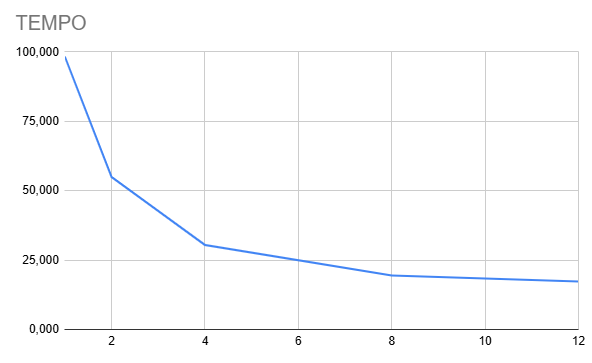
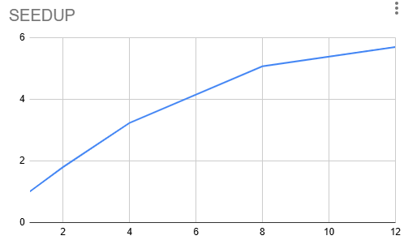
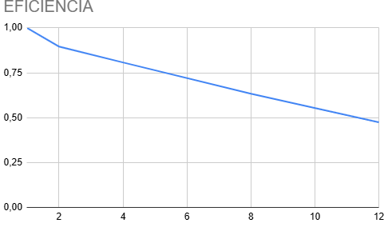

# Relatório da Atividade: Processamento Paralelo de Logs

**Disciplina:** PROGRAMAÇÃO CONCORRENTE E DISTRIBUÍDA  
**Aluno:** Vinícius Caetano de Assis  
**Turma:** 24 | GPADSM  
**Professor:** RAFAEL MARCONI RAMOS  
**Data:** 20/03/2026  

---

## 1. Descrição do Problema

O objetivo foi evoluir um sistema de análise de logs sequencial para uma arquitetura paralela utilizando o modelo Produtor-Consumidor com buffer limitado.

A aplicação processa arquivos de texto, extraindo as seguintes métricas:

- Número de linhas  
- Número de palavras  
- Número de caracteres  
- Contagem de palavras-chave: erro, warning e info  

### Características da Solução

- **Algoritmo:** Implementação com `multiprocessing.Process` e `multiprocessing.Queue`  
- **Modelo:** Produtor-Consumidor  
- **Controle de buffer:** Fila limitada com `maxsize=50`  
- **Volume de dados:** Pasta `log2` contendo múltiplos arquivos de log  

---

## 2. Ambiente Experimental

| Item | Descrição |
|------|----------|
| Processador | Intel Core i7 (32 núcleos lógicos) |
| Memória RAM | 16 GB |
| Sistema Operacional | Windows 11 |
| Linguagem | Python 3.x |

---

## 3. Metodologia de Testes

O experimento consistiu na execução do processamento completo da pasta `log2`, variando o número de processos consumidores:

- 1 (execução serial)  
- 2, 4, 8 e 12 processos  

Para cada configuração:

- Foi medido o tempo total de execução utilizando a biblioteca `time`  
- Foi calculado o speedup e a eficiência  

---

## 4. Resultados Experimentais

| Processos | Tempo (s) | Speedup | Eficiência |
|----------|----------|---------|------------|
| 1 (Serial) | 98,34 | 1,00 | 1,00 |
| 2 | 54,89 | 1,79 | 0,89 |
| 4 | 30,45 | 3,23 | 0,81 |
| 8 | 19,43 | 5,06 | 0,63 |
| 12 | 17,29 | 5,69 | 0,47 |

---

## 5. Grafico

## 6. Análise de Escalabilidade e Eficiência

### 5.1 Speedup

**S = Ts / Tp**

O speedup apresentou crescimento consistente, atingindo **5,69x com 12 processos**.

**Observações:**

- Ganho significativo até 8 processos  
- Após isso, há redução no ganho marginal  
- Indício de saturação do sistema  

---

### 6.2 Eficiência

**E = S / p**

A eficiência apresentou queda conforme o aumento do número de processos:

- 2 processos: 89%  
- 12 processos: 47%  

Essa redução ocorre devido a:

#### Overhead de Gerenciamento
- Criação e sincronização de processos  
- Comunicação via `Queue`  

#### Contenção de I/O
- Múltiplos processos acessando o disco simultaneamente  
- Limitação física do hardware  

---

## 7. Conclusão

A implementação do modelo Produtor-Consumidor foi bem-sucedida, reduzindo o tempo de execução de:

**98,34s → 17,29s**

Isso representa um ganho expressivo de desempenho.

### Principais conclusões:

- O paralelismo melhorou significativamente o tempo de execução  
- A escalabilidade é limitada  
- A eficiência diminui com o aumento de processos  

### Lei de Amdahl

Os resultados confirmam a Lei de Amdahl, onde:

- A parte serial do sistema limita o ganho máximo  

O gargalo principal está em:

- Leitura de arquivos (I/O)  
- Consolidação dos resultados  

### Melhor Configuração

- Entre 8 e 12 processos  
- Melhor equilíbrio entre desempenho e uso de recursos  
